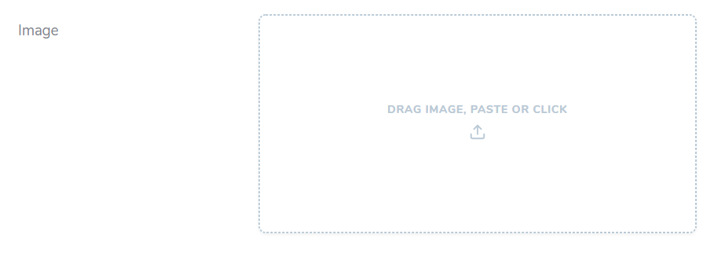
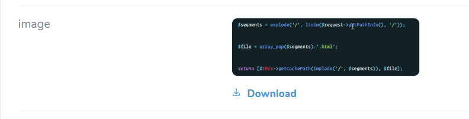
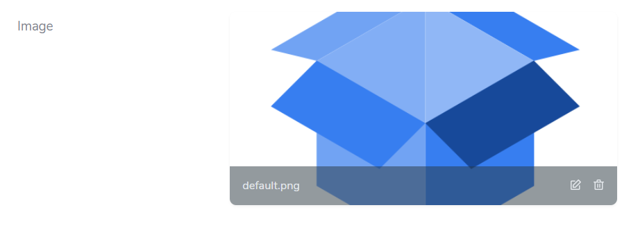
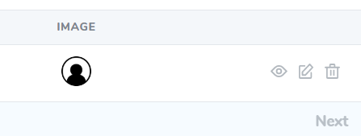
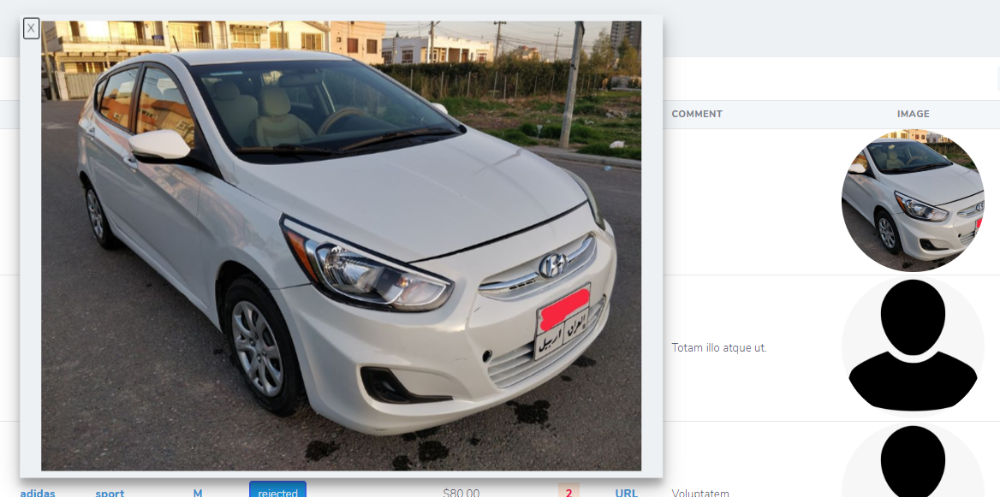

# paste-image

This is a Laravel nova field provides an easy interface to upload delete edit an image. 

Originally package was developed on PHP 7.3.11 and Laravel 7.8, but should work on lower versions too.

## updated to v2.0

## Features
- paste image
- drag and drop
- chose an image 
- preview befor submiting
- change or delete before submitting
- pass custom url only one time for (form, index, view) pages __->url()__ (new to v2.0)
- clickable small image in index view with full-size image in modal (new to v2.0)
- passing __[->acceptedTypes()][link-acceptedTypes]__ like native file field in nova (new to v2.0)
- passing __->sizeForIndex($height, $width)__ customizing image size in index page (new to v2.0)


## Installation

Via Composer

```bash
$ composer require osama/image-paste
```

## Basic Usage

in your resource fields method add the field

```php
use Osama\ImagePaste\ImagePaste;

<...>

ImagePaste::make('Image')->disk('osama')->url('/images/{image}/get-preview-image'), // you can customize it now in v2.0
```

in your config/filesystem.php add this to disks

```php
 'disks' => [
    'osama' => [
                'driver' => 'local',
                'root' => public_path('images/osama'),
                'url' => env('APP_URL').'/images/osama',
                'visibility' => 'public',
            ],
  ],
```

in your route file add this route

```php
Route::get('/images/{image}/get-preview-image', function ($image){  // you can customize it now in v2.0
	return new Response(Storage::disk('osama')->get($image), 200);
});
```

## Advanced Usage

``` php
use Osama\ImagePaste\ImagePaste;

<...>

ImagePaste::make('image')
    ->canSee(function () use ($user) { return $user->hasPermission('orders-fields-image-see');})
    ->hideWhenUpdating(!$user->hasPermission('orders-fields-image-edit'))
    ->disk('osama')  // you can define your own disk
    ->prunable($isNotDefault = $this->image !== 'default.png')
    ->deletable(true) // if true you will see delete icon on the bottom right corner. make sure you make column nullable in you migration
//    ->preview(function () { // related to v1.0
//      return url('/orders/' . $this->id . '/image');
//    })
    ->acceptedTypes('image/*')
    ->sizeForIndex(50, 50) // (height, width) measured with pixels
    ->url('/orders/' . $this->id . '/image') // you can pass custom url to perview image
    ->hideFromIndex()
    ->rules('nullable', 'image', 'max:2000'),

```


## Author

- [osama][link-author]


## Issues
  if you found any issues feel free to register it in issues.
  
## Screenshots
   
Create | Detail | Update | Index | Modal in index
------------ | ------------- | ------------- | ------------- | -------------
  | |  |  |  


[link-author]: https://github.com/osamaAbdullah
[link-acceptedTypes]: https://nova.laravel.com/docs/2.0/resources/file-fields.html#customizing-accepted-file-types
